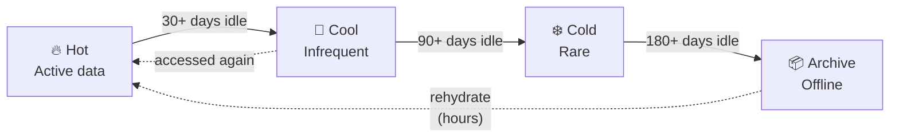
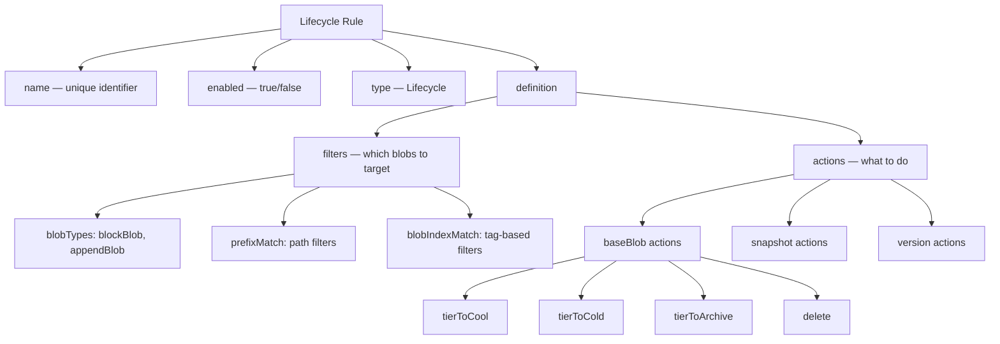
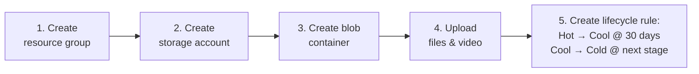

# Azure Blob Storage: Access Tiers & Lifecycle Management

## Why This Matters

Storing data in the cloud isn't "one size fits all" pricing. Azure Blob Storage lets you match **cost** to **how often data is actually touched** — and then **automate** moving data between cost tiers as it ages, so you're never paying Hot-tier prices for data nobody has opened in a year.



---

## 1. The Four Access Tiers

| Tier | Access Latency | Min Storage Duration | Storage Cost | Access Cost | Best For |
|---|---|---|---|---|---|
| **Hot** | Milliseconds | None | Highest | Lowest | Active workloads, frequently read/written data |
| **Cool** | Milliseconds | 30 days | ~50% less than Hot | Higher than Hot | Short-term backups, occasionally-read older data |
| **Cold** | Milliseconds | 90 days | Lower than Cool | Higher than Cold | Long-term backups, rarely-accessed compliance archives |
| **Archive** | **Hours** (rehydration) | 180 days | ~90% less than Hot | Highest | Long-term retention, compliance, forensic data |

**The trade-off in one sentence:** the cheaper the storage tier, the more expensive (and slower) it is to *read* the data back — so pick a tier based on how often you'll actually access the data, not just how important it is.

### Tier-by-Tier Cheat Sheet

| | Hot | Cool | Cold | Archive |
|---|---|---|---|---|
| Typical access | Daily / continuous | Monthly | Quarterly | Rarely, if ever |
| Early-deletion penalty | None | Yes, if removed < 30 days | Yes, if removed < 90 days | Yes, if removed < 180 days |
| Retrieval time | Instant | Instant | Instant | Up to 15 hrs (Standard) / ~1 hr (High Priority) |
| Example workload | Live app/media streaming | Monthly backups | Archived project files | Regulatory/forensic records |

> **Rehydration** is the process of moving an Archive blob back to Hot/Cool before you can read it — it isn't instant like the other tiers, which is the main thing that trips people up in exams and in production incidents.

---

## 2. Lifecycle Management: Automating Tier Transitions

Manually re-tiering thousands of blobs doesn't scale. **Lifecycle Management** rules run automatically (evaluated **once per day**) at the storage account or container level, moving or deleting blobs based on age.

### Anatomy of a Rule



### Supported Actions & Their Trigger Conditions

| Action | Trigger Condition | Effect |
|---|---|---|
| `tierToCool` | `daysAfterModificationGreaterThan` | Moves blob to Cool after N days |
| `tierToCold` | `daysAfterModificationGreaterThan` | Moves blob to Cold after N days |
| `tierToArchive` | `daysAfterModificationGreaterThan` | Moves blob to Archive after N days |
| `delete` | `daysAfterModificationGreaterThan` | Permanently deletes blob after N days |
| `enableAutoTierToHotFromCool` | `daysAfterLastAccessTimeGreaterThan` | Automatically promotes back to Hot if accessed |

### Worked Example: A Realistic Rule

Say you want files older than 30 days to drop to Cool, and anything older than 90 days to drop to Cold:

```json
{
  "rules": [
    {
      "name": "move-old-data-down-tiers",
      "enabled": true,
      "type": "Lifecycle",
      "definition": {
        "filters": {
          "blobTypes": ["blockBlob"],
          "prefixMatch": ["container1/uploads/"]
        },
        "actions": {
          "baseBlob": {
            "tierToCool": { "daysAfterModificationGreaterThan": 30 },
            "tierToCold": { "daysAfterModificationGreaterThan": 90 }
          }
        }
      }
    }
  ]
}
```

**How to read this:** any `blockBlob` under the `container1/uploads/` path automatically moves to Cool 30 days after its last modification, and to Cold at the 90-day mark — no manual intervention, no scripts to schedule.

---

## 3. Hands-On Task (Azure CLI)

The classroom task ties both concepts together — provisioning storage and then attaching a lifecycle rule to it:



| Step | What it does |
|---|---|
| 1. Create resource group | Logical container for all the resources you'll create |
| 2. Create storage account | The billing/management boundary for your blob storage |
| 3. Create blob container | Where the actual files/blobs live |
| 4. Upload files & video | Populate with real objects to re-tier |
| 5. Create storage lifecycle rule | Automate: 30 days after upload → Cool tier; Cool → Cold on a later threshold |

**Reference docs from the session:**
- Storage task quickstart (portal): `https://learn.microsoft.com/en-us/azure/storage-actions/storage-tasks/storage-task-quickstart-portal#create-a-task`
- Storage Discovery workspace: `https://learn.microsoft.com/en-us/azure/storage-discovery/create-workspace?tabs=portal`

---

## Key Takeaways

- **Four tiers, one spectrum:** Hot → Cool → Cold → Archive trades cheaper storage for more expensive/slower retrieval. There's no "best" tier — only the right tier for your access pattern.
- **Archive is not instant.** Rehydration can take up to 15 hours (Standard) — never put data in Archive if you might need it back quickly.
- **Early deletion penalties exist for Cool, Cold, and Archive** (30/90/180-day minimums) — moving data down a tier and then deleting it early costs you.
- **Lifecycle Management rules run once a day** and are defined declaratively (JSON) with `filters` (which blobs) and `actions` (what to do to them) — this is the automation layer that makes tiering practical at scale.
- **`enableAutoTierToHotFromCool`** is the "safety valve" — if cold data suddenly gets accessed again, it can auto-promote back to Hot rather than staying expensive-to-read.
