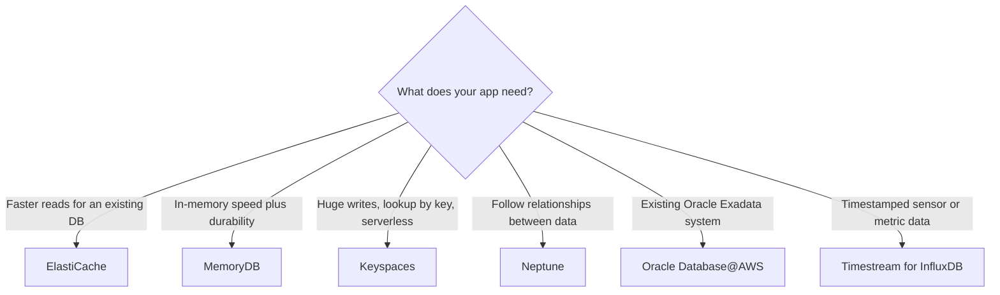

# AWS Database Services: Definition, Use Cases, Key Points, Steps to Create and Where to Use

| Service | Data model | Query | Use case | Created with |
|---|---|---|---|---|
| ElastiCache | Key-value in memory | Valkey/Redis commands | Cache, sessions, leaderboards | Serverless cache or replication group |
| Keyspaces | Wide-column | CQL | Order history, IoT events at scale | Keyspace + table |
| MemoryDB | Key-value in memory, durable | Valkey/Redis commands | Cart, inventory, real-time primary DB | Cluster + ACL |
| Neptune | Graph | openCypher, Gremlin, SPARQL | Recommendations, fraud | Cluster + instance |
| Oracle Database@AWS | Relational | SQL / PL/SQL | Oracle Exadata lift and shift | ODB network + Exadata + VM cluster |
| Timestream for InfluxDB | Time series | Flux, InfluxQL | IoT, metrics | InfluxDB instance |

> **Timestream note:** Timestream for LiveAnalytics has been closed to new customers since June 20, 2025. New projects should use **Timestream for InfluxDB**, which is what this guide covers.



**Common setup for private services** (ElastiCache, MemoryDB, Neptune, InfluxDB): a VPC with two subnets in different AZs, a security group that allows the service port from your client, and an EC2 instance in the same VPC to connect from.

---

## 1. Amazon ElastiCache

### Definition

A managed in-memory data store that supports **Valkey**, **Redis OSS** and **Memcached**. Data sits in RAM, so reads take microseconds. It is mostly used as a **cache** in front of a slower database.

### Use cases

- Cache database query results and API responses
- Session store for web applications
- Leaderboards and counters (sorted sets, `INCR`)
- Rate limiting
- Pub/sub messaging

### Key points

- Two deployment modes: **Serverless** (no sizing) and **node-based** (you pick node type, shards and replicas).
- Valkey and Redis OSS support replication, automatic failover, backups, TLS and role-based access control. Memcached does not support replication or backups.
- Runs only **inside a VPC**; there is no public endpoint.
- **Global datastore** gives cross-region replication for Valkey and Redis OSS.
- It is a cache, not the source of truth. Data can be lost, so keep the real data in a database.

### Steps to create

1. Open **ElastiCache > Valkey caches > Create cache**.
2. Choose **Serverless** or **Design your own cache**; engine **Valkey**; name `demo-cache`.
3. Select the VPC, two subnets and the security group (port `6379`).
4. Click **Create**, wait for **Available**, copy the endpoint.
5. Connect from EC2: `valkey-cli -h <endpoint> -p 6379 --tls`
6. Test: `SET product:101 "Laptop" EX 300` then `GET product:101`.

CLI:

```bash
aws elasticache create-serverless-cache \
  --serverless-cache-name demo-cache --engine valkey \
  --subnet-ids subnet-aaaa1111 subnet-bbbb2222 --security-group-ids sg-0123456789abcdef0
```

### Where to use

| Scenario | How it helps |
|---|---|
| E-commerce product pages | Serves popular products from memory and offloads the database |
| Web login sessions | Fast shared session store across many app servers |
| Gaming | Live leaderboards with sorted sets |
| Public APIs | Rate limiting and response caching |

---

## 2. Amazon Keyspaces (for Apache Cassandra)

### Definition

A **serverless, Cassandra-compatible** wide-column database. You use **CQL** and Cassandra drivers without managing servers, nodes or patching.

### Use cases

- Order and transaction history per customer
- IoT and device event storage
- User activity feeds and messaging history
- Audit and event logs
- Migrating an existing Cassandra application to a managed service

### Key points

- Tables are designed around the query: **partition key** decides where data lives, **clustering columns** decide sort order.
- No joins and no ad hoc queries across partitions.
- Capacity modes: **on-demand** or **provisioned**.
- Data is replicated across three AZs and encrypted at rest.
- Connections use **TLS** on port `9142` to a public regional endpoint (`cassandra.<region>.amazonaws.com`).
- Table creation is asynchronous; wait for status `ACTIVE`.

### Steps to create

1. Open **Keyspaces > Keyspaces > Create keyspace**, name `shop`.
2. Open **Tables > Create table**: keyspace `shop`, table `orders`.
3. Columns: `customer_id` text, `order_ts` timestamp, `order_id` uuid, `amount` decimal, `status` text.
4. Partition key `customer_id`; clustering column `order_ts` descending; capacity **On-demand**; click **Create table**.
5. Open the **CQL editor** and insert data:

```sql
INSERT INTO shop.orders (customer_id, order_ts, order_id, amount, status)
VALUES ('C1001', '2026-09-30 09:05:00+0000', 33333333-3333-3333-3333-333333333333, 15999.00, 'PLACED');

SELECT * FROM shop.orders WHERE customer_id = 'C1001';
```

CQL equivalent for creation:

```sql
CREATE KEYSPACE shop WITH replication = {'class': 'SingleRegionStrategy'};
CREATE TABLE shop.orders (
  customer_id text, order_ts timestamp, order_id uuid, amount decimal, status text,
  PRIMARY KEY (customer_id, order_ts)
) WITH CLUSTERING ORDER BY (order_ts DESC);
```

### Where to use

| Scenario | How it helps |
|---|---|
| Retail and banking order history | Fast "latest N records for this customer" at any scale |
| Telecom and IoT | Very high write volume of events per device |
| Messaging apps | Chat history partitioned by conversation |
| Cassandra migration | Same CQL and drivers with no cluster to operate |

---

## 3. Amazon MemoryDB

### Definition

A fully managed, **Valkey and Redis OSS compatible in-memory database** that is also **durable**. Writes are stored in a **Multi-AZ transaction log** before they are acknowledged, so data survives failover.

### Use cases

- Shopping carts
- Real-time inventory and stock counters
- Gaming state and player profiles
- Fraud and risk scoring that needs instant lookups
- Streams and queues that must not lose messages

### Key points

- Use it as a **primary database**, not just a cache.
- Reads in microseconds; writes in single-digit milliseconds because of the durable log.
- An **Access Control List (ACL)** is required when you create a cluster. `open-access` has no authentication and is for labs only.
- TLS is enabled by default.
- Scales with shards (data and writes) and replicas (reads and availability).
- Supports the Valkey and Redis OSS data types and commands: hashes, lists, sets, sorted sets, streams.

### ElastiCache vs MemoryDB

| | ElastiCache | MemoryDB |
|---|---|---|
| Role | Cache in front of a database | Primary database |
| Durability | Not designed as durable store | Multi-AZ transaction log |
| Write latency | Microseconds | Single-digit milliseconds |

### Steps to create

1. Open **MemoryDB > Clusters > Create cluster**.
2. Name `demo-memorydb`; engine **Valkey**; node type `db.t4g.small`; 1 shard, 1 replica.
3. Create or choose a **subnet group** (two subnets) and a **security group** (port `6379`).
4. Choose ACL `open-access` for a lab.
5. Click **Create**, wait for **Available**, copy the cluster endpoint.
6. Connect from EC2: `valkey-cli -h <cluster-endpoint> -p 6379 --tls -c`
7. Test:

```text
HSET cart:user42 prod:101 1 prod:205 3
HGETALL cart:user42
```

CLI:

```bash
aws memorydb create-subnet-group --subnet-group-name demo-memdb-subnets \
  --subnet-ids subnet-aaaa1111 subnet-bbbb2222
aws memorydb create-cluster --cluster-name demo-memorydb --engine valkey \
  --node-type db.t4g.small --acl-name open-access \
  --subnet-group-name demo-memdb-subnets --security-group-ids sg-0123456789abcdef0 \
  --num-shards 1 --num-replicas-per-shard 1
```

### Where to use

| Scenario | How it helps |
|---|---|
| Online retail carts | Instant reads and no cart loss on failover |
| Online games | Live state that must survive node failure |
| Finance and ad tech | Real-time lookups with durable data |
| Microservices | A single fast datastore with no separate backing database |

---

## 4. Amazon Neptune

### Definition

A fast, reliable **graph database** built for the cloud. Data is stored as **nodes** (entities), **edges** (relationships) and **properties**, and queried with **openCypher**, **Gremlin** or **SPARQL**.

### Use cases

- Social networks and friend recommendations
- Fraud detection (rings of connected accounts, devices and cards)
- Knowledge graphs
- Network, IT and dependency mapping
- Product and content recommendation engines

### Key points

- Built for queries that follow relationships many hops deep, which need many costly joins in SQL.
- Property graph (openCypher, Gremlin) and RDF (SPARQL) models are both supported.
- Storage is replicated across multiple AZs and grows automatically; read replicas scale reads.
- A **serverless** option scales capacity automatically.
- Runs inside a VPC; HTTPS endpoint on port `8182`. IAM authentication can be enabled.
- Not meant for bulk tabular reporting.

### Steps to create

1. Open **Neptune > Databases > Create database**.
2. Choose **Standard create**, engine **Neptune**, template **Development and testing**.
3. Identifier `demo-neptune`; instance class `db.t4g.medium`.
4. Select the VPC, a subnet group (two subnets) and the security group (port `8182`).
5. Click **Create database**, wait for **Available**, copy the cluster endpoint.
6. From EC2, insert and query:

```bash
export NEPTUNE=https://<cluster-endpoint>:8182

curl -s $NEPTUNE/openCypher --data-urlencode "query=
CREATE (:Person {name:'Alice'}), (:Person {name:'Bob'})"

curl -s $NEPTUNE/openCypher --data-urlencode "query=
MATCH (a:Person {name:'Alice'}), (b:Person {name:'Bob'}) CREATE (a)-[:FRIENDS_WITH]->(b)"

curl -s $NEPTUNE/openCypher --data-urlencode "query=
MATCH (:Person {name:'Alice'})-[:FRIENDS_WITH]->(f) RETURN f.name"
```

CLI:

```bash
aws neptune create-db-subnet-group --db-subnet-group-name demo-neptune-subnets \
  --db-subnet-group-description "demo" --subnet-ids subnet-aaaa1111 subnet-bbbb2222
aws neptune create-db-cluster --db-cluster-identifier demo-neptune --engine neptune \
  --db-subnet-group-name demo-neptune-subnets --vpc-security-group-ids sg-0123456789abcdef0
aws neptune create-db-instance --db-instance-identifier demo-neptune-1 \
  --db-instance-class db.t4g.medium --engine neptune --db-cluster-identifier demo-neptune
```

### Where to use

| Scenario | How it helps |
|---|---|
| Banking and payments | Spot connected fraudulent accounts quickly |
| Social and dating apps | "People you may know" in milliseconds |
| Enterprise search and data catalogs | Knowledge graph linking documents, people and topics |
| IT operations | Map which services depend on which servers |

---

## 5. Oracle Database@AWS

### Definition

**Oracle Exadata infrastructure running inside AWS data centers**, operated by Oracle (OCI) and connected privately to your AWS VPC. It lets you run Oracle Exadata Database Service workloads next to AWS applications and services. It is purchased through an **AWS Marketplace private offer**.

### Use cases

- Lift and shift of on-premises Oracle Exadata databases (including RAC)
- Oracle ERP, billing and core banking systems moving closer to AWS applications
- Low-latency access between Oracle databases and AWS compute, analytics and AI services
- Data centre exit while keeping Oracle features

### Key points

- You keep Oracle features and Exadata performance with no application rewrite.
- Oracle manages the Exadata infrastructure; AWS provides the location, networking and billing through Marketplace.
- Connectivity uses an **ODB network** peered with your VPC; SQL traffic uses port `1521`.
- Standard Oracle SQL and PL/SQL, so existing tools and code keep working.
- Needs a private offer and real Exadata capacity, so it is not a quick, cheap lab.

### Steps to create

1. **Subscribe**: accept the Oracle Database@AWS private offer in AWS Marketplace and link your OCI account.
2. Open the **Oracle Database@AWS** console, **ODB networks > Create ODB network** (client and backup subnet CIDRs).
3. **Exadata infrastructure > Create** (shape, database and storage servers, AZ).
4. **VM clusters > Create** on that infrastructure (Grid Infrastructure version, cores, storage, SSH key).
5. **Create the Oracle database** in the VM cluster using Oracle's tooling (OCI console or API). Confirm the current flow in the AWS documentation.
6. **Peer the ODB network with your VPC** and allow port `1521` from your app subnet.
7. Connect and test from EC2:

```bash
sqlplus app_user/<password>@//<scan-or-host>:1521/<service_name>
```

```sql
CREATE TABLE employees (
  emp_id NUMBER GENERATED ALWAYS AS IDENTITY PRIMARY KEY,
  emp_name VARCHAR2(50) NOT NULL, department VARCHAR2(30), salary NUMBER(10,2)
);
INSERT INTO employees (emp_name, department, salary) VALUES ('Asha', 'Finance', 75000);
COMMIT;
SELECT * FROM employees;
```

The AWS CLI also has an `odb` command group; run `aws odb help` to see what your version supports.

### Where to use

| Scenario | How it helps |
|---|---|
| Large enterprises on Oracle Exadata | Move to AWS without re-platforming the database |
| Banking, telecom, retail core systems | Keep Oracle RAC-class performance next to modern AWS apps |
| Hybrid modernisation | Keep the database as-is while rebuilding the application tier |

---

## 6. Amazon Timestream for InfluxDB

### Definition

A managed **time series database** based on **InfluxDB**. It stores timestamped data points (sensor readings, metrics, events) and is optimized for fast ingestion and time-window queries.

### Use cases

- IoT and industrial sensor telemetry
- Application and infrastructure monitoring metrics
- Real-time dashboards and alerting
- Financial tick data and operational analytics

### Key points

- Data model: **measurement** (like a table), **tags** (indexed labels), **fields** (values) and a **timestamp**.
- Write with **line protocol**; query with **Flux** or **InfluxQL**.
- Supports Single-AZ and Multi-AZ deployments.
- Runs in a VPC; API on port `8086`.
- The admin API token is stored in **AWS Secrets Manager**.
- Timestream for LiveAnalytics is the older serverless flavour and is closed to new customers.

### Steps to create

1. Open **Timestream > InfluxDB databases > Create InfluxDB database**.
2. Name `demo-influx`; set username, password, organization `demo-org` and bucket `sensors`.
3. Choose instance class and storage; deployment **Single-AZ** for a lab.
4. Select the VPC, subnets and security group (port `8086`).
5. Click **Create**, wait for **Available**, copy the endpoint, and get the admin token from Secrets Manager.
6. From EC2, write and query data:

```bash
export INFLUX=https://<endpoint>:8086
export TOKEN=<admin-api-token>

curl -s -X POST "$INFLUX/api/v2/write?org=demo-org&bucket=sensors&precision=s" \
  -H "Authorization: Token $TOKEN" \
  --data-binary 'temperature,device=sensor1,room=lab value=24.5
temperature,device=sensor2,room=warehouse value=31.8'

curl -s -X POST "$INFLUX/api/v2/query?org=demo-org" \
  -H "Authorization: Token $TOKEN" \
  -H "Content-Type: application/vnd.flux" -H "Accept: application/csv" \
  --data-binary 'from(bucket:"sensors") |> range(start:-1h) |> filter(fn:(r)=>r._measurement=="temperature") |> mean()'
```

CLI:

```bash
aws timestream-influxdb create-db-instance \
  --name demo-influx --username admin --password '<StrongPassword123>' \
  --organization demo-org --bucket sensors \
  --db-instance-type db.influx.medium --db-storage-type InfluxIOIncludedT1 \
  --allocated-storage 20 \
  --vpc-subnet-ids subnet-aaaa1111 subnet-bbbb2222 \
  --vpc-security-group-ids sg-0123456789abcdef0 --deployment-type SINGLE_AZ
```

Run `aws timestream-influxdb create-db-instance help` if a parameter name differs in your CLI version.

### Where to use

| Scenario | How it helps |
|---|---|
| Manufacturing | Machine temperature and vibration monitoring with alerts |
| DevOps and SRE | Store and chart server and application metrics |
| Smart buildings, energy, utilities | Meter and sensor trends over time |
| Fintech | Time-ordered price and transaction analysis |

---

## 7. Final Comparison

| | ElastiCache | Keyspaces | MemoryDB | Neptune | Oracle Database@AWS | Timestream for InfluxDB |
|---|---|---|---|---|---|---|
| Type | In-memory cache | Wide-column | In-memory database | Graph | Relational | Time series |
| Durable primary store | No | Yes | Yes | Yes | Yes | Yes |
| Serverless option | Yes | Yes (fully) | No | Yes | No | No |
| Access | VPC only | Public endpoint (TLS) | VPC only | VPC only | Private ODB network | VPC |
| Best for | Speeding up reads | Massive key-based writes | Fast and durable state | Relationships | Oracle workloads | Sensor and metric data |

## 8. Cleanup Reminder

ElastiCache, MemoryDB, Neptune, Timestream for InfluxDB and Oracle Database@AWS **bill while they exist**. Delete lab resources when you finish: `delete-serverless-cache`, `delete-cluster`, `delete-db-instance` then `delete-db-cluster`, and `aws timestream-influxdb delete-db-instance`. For Keyspaces, `DROP TABLE` and `DROP KEYSPACE`.
